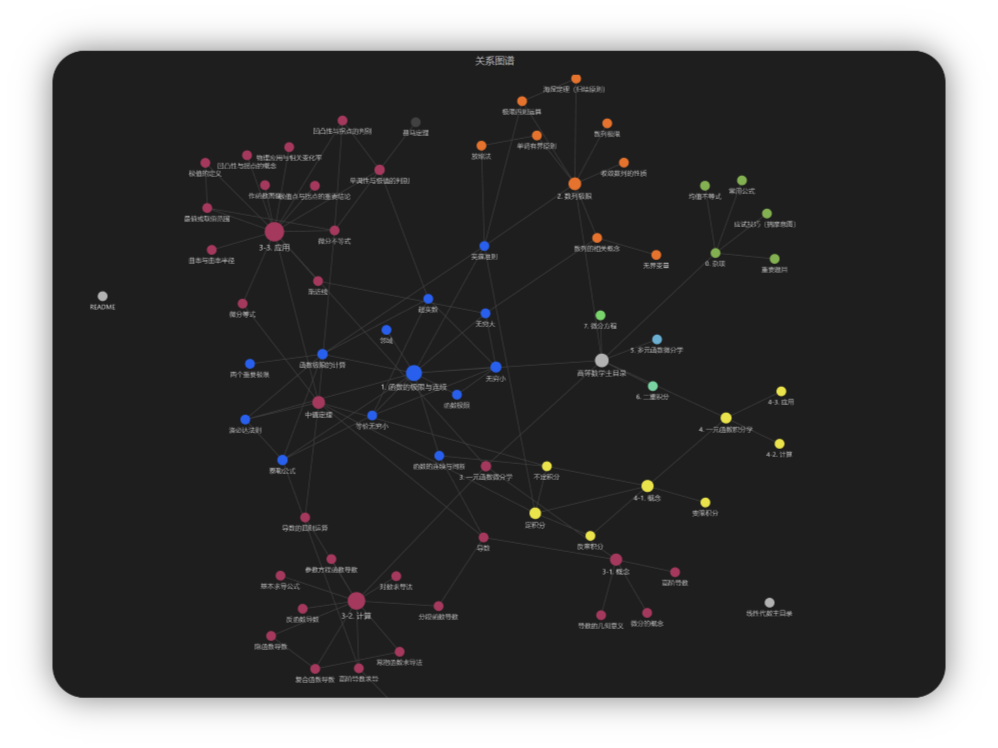
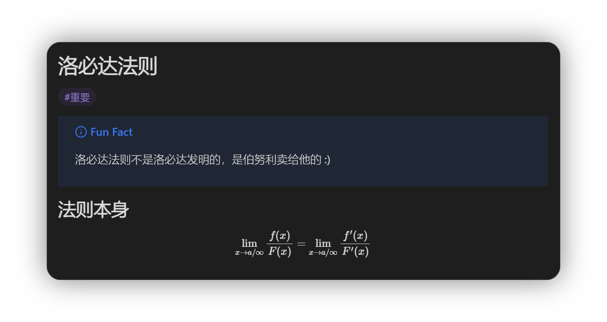
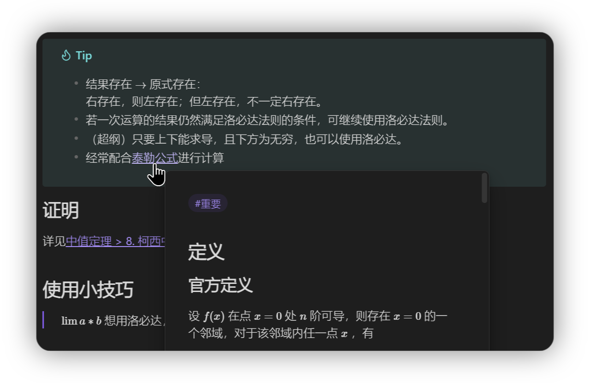

# 考研笔记 22408 Obsidian

## 目录
- [关于本项目](#关于本项目)
- [版本控制](#版本控制)
- [功能一览](#功能一览)
- [如何使用](#如何使用)
- [作者](#作者)
- [版权声明](版权声明)
- [鸣谢](#鸣谢)
### 关于本项目

本仓库是基于Obsidian的markdown笔记，数学主体部分为开源项目[obsidian_math]([BlandAlpha/obsidian_math: 适用于Obsidian的考研数学2笔记。](https://github.com/BlandAlpha/obsidian_math)),该项目基于🐙基础30讲的内容整理了考研数学数学二的详细内容。在此基础之上本项目将基于本人强化阶段的刷题复习，对各单元的题型进行分类整理，力求逐个击破，同时尝试进行408内容的更新。
#### 使用第三方插件列表

1. Completr
2. Git
3. Quick Latex
### 版本控制

该项目使用Git进行版本管理。您可以在repository参看当前可用版本。
本仓库理论上说可以被任何markdown阅读器打开；但Obsidian可以使用**标签**、**内部链接跳转**和**知识图谱**功能，可以渲染**CallOut块**，获得最完整的体验。
### 功能一览

#### 1. 关系图谱

#### 2. 标签、公式渲染、CallOut渲染

#### 3. 快速链接

### 如何使用

本地使用只需下载本仓库并使用Obsidian打开即可。
#### Git 快捷键

1. Commit all: `Alt + C`
2. Pull: `Ctrl + Shift + -`
3. Push: `Ctrl + Shift + +`

你可以在设置中更改自己的快捷键。

### 作者

skitre5515@outlook.com

知乎:ASW  &ensp; qq:905488558   

### 版权说明

本项目遵循 `GPL-3.0` 协议开源。任何衍生项目**必须**遵守相同协议进行开源。

### 鸣谢

- 感谢[BlandAlpha (CanisAlpha)](https://github.com/BlandAlpha)佬的开源，本人为二战考生，一战大清失败，于毕业后开始进行第二次备考，想要冲抓基础但是时间紧张，全网找适合重温知识点的笔记，BA佬的笔记让我眼前一亮，遂萌生在此基础上进行复习的想法，也希望能帮到大家。